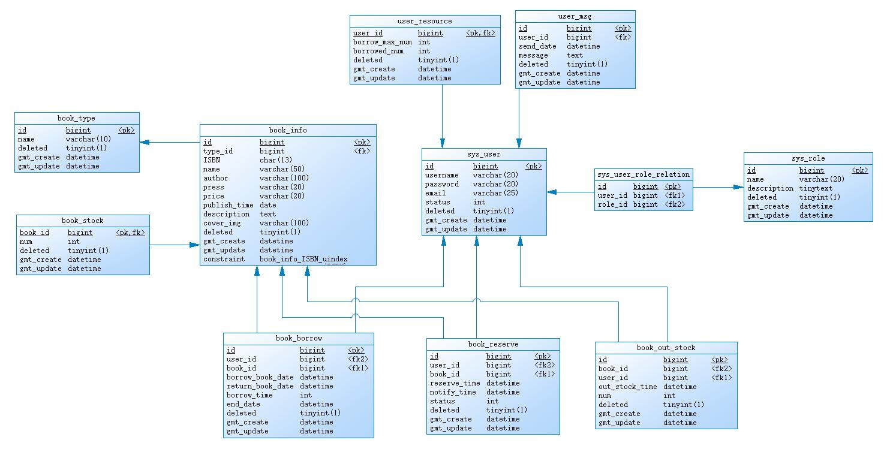
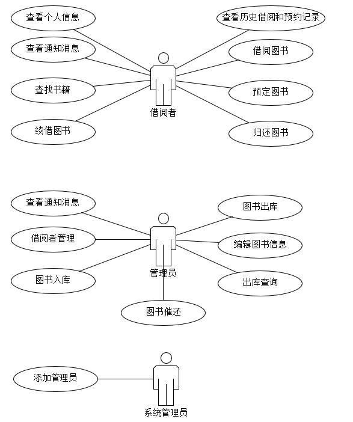

# 图书管理系统

## 基本信息

- **系统包括系统管理员、图书管理员、借阅者三种角色**

- **系统功能包括：图书入库、出库、借书、还书、续借、预定书、催还书、缺书通知等**

## 数据库设计

> **PDM图如下**

## 用例图

## 技术选型

### 前端技术

> **前端Vue项目通过vue-cli构建**

|          技术          |       说明       |                             官网                             |
| :--------------------: | :--------------: | :----------------------------------------------------------: |
|     **vue@3.2.33**     |     前端框架     |     [https://v3.cn.vuejs.org/](https://v3.cn.vuejs.org/)     |
| **vue-router@4.0.15**  |   前端路由框架   | [https://router.vuejs.org/zh/](https://router.vuejs.org/zh/) |
|    **pinia@2.0.14**    | 全局状态管理框架 |     [https://pinia.vuejs.org/](https://pinia.vuejs.org/)     |
|    **axios@0.27.2**    |   前端HTTP框架   |                https://github.com/axios/axios                |
| **element-plus@2.2.0** |    前端UI框架    | [https://element-plus.org/zh-CN/#/zh-CN](https://element-plus.org/zh-CN/#/zh-CN) |
|  **nprogress@0.2.0**   |    进度条控件    | [https://github.com/rstacruz/nprogress](https://github.com/rstacruz/nprogress) |

### 后端技术

> **后端项目通过Maven构建**

> **数据库版本：mysql-8.0.25-winx64**

|       **技术**        |     **说明**      |                           **官网**                           |
| :-------------------: | :---------------: | :----------------------------------------------------------: |
| **SpringBoot@2.5.2**  |   容器+MVC框架    |            https://spring.io/projects/spring-boot            |
| **MyBatisPlus@3.5.1** |      ORM框架      |        [https://baomidou.com/](https://baomidou.com/)        |
|       **Redis**       |    分布式缓存     |                      https://redis.io/                       |
|   **Swagger@3.0.0**   |   文档生成工具    | [https://github.com/springfox/springfox](https://github.com/springfox/springfox) |
|    **JWT@3.10.3**     |    JWT登录支持    | [https://github.com/auth0/java-jwt](https://github.com/auth0/java-jwt) |
|  **EasyExcel@3.1.0**  | JAVA解析Excel工具 | [https://github.com/alibaba/easyexcel](https://github.com/alibaba/easyexcel) |

## 项目截图

### 借阅者

### 管理员

### 系统管理员